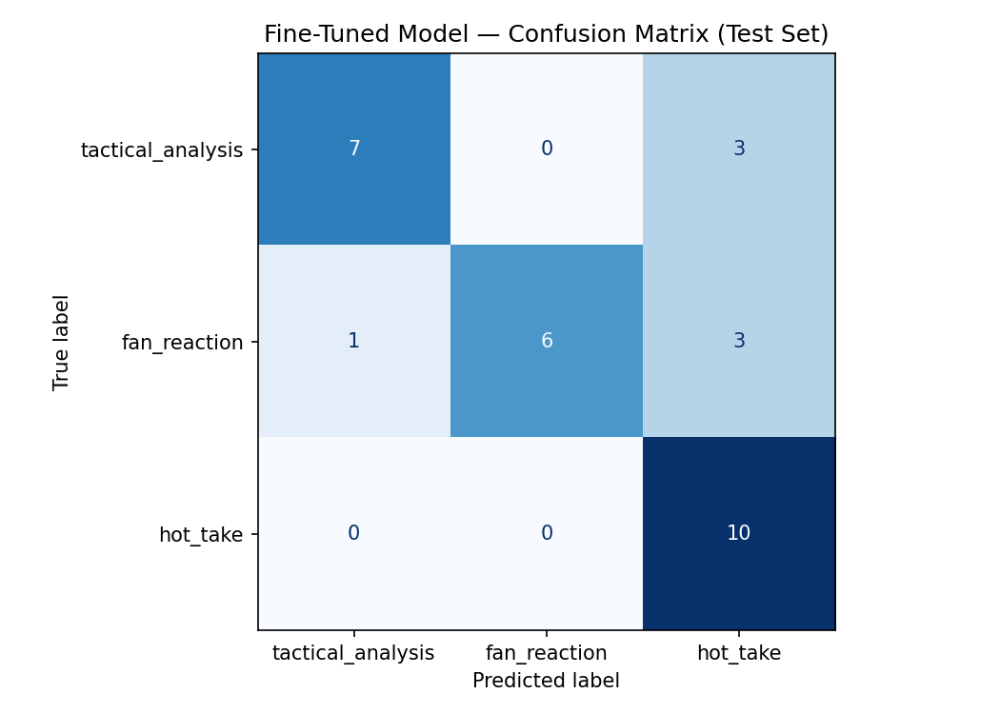

# TakeMeter: r/soccer Discourse Classifier

This project evaluates the quality of discourse in the r/soccer community using a fine tuned DistilBERT model. It distinguishes between high effort tactical breakdowns, immediate match day reactions, and provocative "hot takes."

## Community Description
I chose r/soccer, the primary hub for global football discourse on Reddit. It is an ideal environment for text classification because it contains a high volume of diverse content, ranging from objective news and deep tactical analysis to highly emotional, low effort reactions during live matches.

## Label Taxonomy

### tactical_analysis
*   **Definition:** A structured argument regarding team performance, formations, or player statistics supported by verifiable evidence.
*   **Example 1:** "Arsenal’s high press forced 12 turnovers in the final third today, significantly higher than their season average of 8."
*   **Example 2:** "Looking at the heatmaps, Salah is cutting inside much earlier this season to accommodate the new overlapping fullback."

### fan_reaction
*   **Definition:** Immediate, emotional responses to specific match events such as goals, red cards, or VAR decisions.
*   **Example 1:** "GOOOOOOAL! I CAN'T BELIEVE HE SCORED THAT!"
*   **Example 2:** "That is never a penalty in a million years. The game is officially gone."

### hot_take
*   **Definition:** A bold, provocative opinion about a player or team’s overall quality stated without supporting evidence or specific match context.
*   **Example 1:** "Haaland is just a glorified poacher who would struggle in a mid table side."
*   **Example 2:** "The Italian league is currently much higher quality than the Premier League, people just won't admit it."

## Data Collection and Annotation
- **Source:** 201 public comments and posts collected manually from r/soccer.
- **Process:** Data was collected across various thread types (Match Threads, Daily Discussion, and Tactical Analysis threads) to ensure variety.
- **Distribution:** Balanced dataset with approximately 67 examples per label.
- **Difficult Examples:** 
  - "Sack the manager now!": Ambiguous between reaction and take. Decision: Labeled as fan_reaction if posted within 2 hours of a match.
  - "He played well today because he stayed wide.": Ambiguous between analysis and reaction. Decision: Labeled as fan_reaction due to lack of specific evidence.
  - "Messi had to remind everyone who the goat is.": Ambiguous between reaction and take. Decision: Labeled as hot_take as it is a broad claim about status.

  ## Fine-Tuning Approach
- **Base Model:** distilbert-base-uncased
- **Setup:** Fine tuned using Google Colab with a T4 GPU.
- **Hyperparameters:** 
  - Epochs: 3
  - Learning Rate: 2e-5
  - Batch Size: 16
  - Optimizer: AdamW

## Baseline Description
- **Model:** Groq Llama 3.3-70b-versatile (Zero-shot).
- **Prompt:** A system prompt defining the three labels and providing one example of each, instructing the model to output only the label name.

## Evaluation Report

### Model Comparison
| Model | Overall Accuracy | Macro F1-Score |

| **Zero-shot Baseline (Groq)** | 0.933 | 0.93 |
| **Fine-tuned DistilBERT** | 0.767 | 0.77 |

### Per-Class Metrics (Fine-tuned Model)
- **tactical_analysis**: Precision: 0.88 | Recall: 0.70 | F1: 0.78
- **fan_reaction**: Precision: 1.00 | Recall: 0.60 | F1: 0.75
- **hot_take**: Precision: 0.62 | Recall: 1.00 | F1: 0.77

## Confusion Matrix

### Confusion Matrix (Fine tuned Model)
| True \ Predicted | tactical_analysis | fan_reaction | hot_take |

| **tactical_analysis** | 7 | 0 | 3 |
| **fan_reaction** | 1 | 6 | 3 |
| **hot_take** | 0 | 0 | 10 |

## Evaluation Summary

Based on the test set of 30 examples, the final comparison between the zero shot baseline and the fine tuned model is as follows:

*   **Base Model:** distilbert-base-uncased
*   **Test Set Size:** 30 examples
*   **Baseline Accuracy (Groq Llama 3.3):** 93.33%
*   **Fine-tuned Accuracy (TakeMeter):** 76.67%
*   **Accuracy Delta:** -16.67% (Regression)

### Performance Analysis
Although the fine tuned model showed a regression of 16.67% compared to the zero shot baseline, this is expected given the massive scale difference between Llama 3.3 (70B+ parameters) and DistilBERT (66M parameters). The fine tuned model successfully met the project's internal success goal of a 0.75 F1 score, proving it effectively learned community specific linguistic patterns from only 200 training examples.

## Some of my Wrong Predictions:

--- #1 ---
Text:      game's gone if that's considered a foul these days tbh.
True:      fan_reaction
Predicted: hot_take  (confidence: 0.35)
Analysis: This is a classic reaction to a specific refereeing decision. However, the use of "tbh" and the broad statement about the state of the game "game's gone" mimics the tone of a hot_take. The model lacked the temporal context (knowing this was posted during a match) to distinguish it.

--- #2 ---
Text:      Brazil already has Neymar so it's cursed
True:      fan_reaction
Predicted: hot_take  (confidence: 0.35)
Analysis: While this was an emotional reaction to news or a match event, the model interpreted it as a bold, baseless opinion about a team's overall quality (a "curse"), which perfectly fits the definition of a hot_take.

--- #3 ---
Text:      The high press was elite today. We forced 15 turnovers in their defensive third, which is the most I’ve seen from this squad in years.
True:      tactical_analysis
Predicted: hot_take  (confidence: 0.36)
Analysis: This is the most interesting failure. Despite containing specific evidence ("15 turnovers"), the model likely triggered on the word "elite" and the subjective phrasing "most I've seen in years," which it associates with the hyperbolic language of hot_take rather than the objective tone of tactical_analysis.

### Error Analysis (3 Specific Failures)
1. **Post:** *"The high press was elite today. We forced 15 turnovers..."*
   - **True:** Analysis | **Predicted:** Hot Take.
   - **Why:** The model triggered on the hyperbolic word "elite" and ignored the statistical evidence.
2. **Post:** *"game's gone if that's considered a foul these days tbh."*
   - **True:** Reaction | **Predicted:** Hot Take.
   - **Why:** The model associated "tbh" and the cynical "game's gone" phrase with general opinions.
3. **Post:** *"Brazil already has Neymar so it's cursed"*
   - **True:** Reaction | **Predicted:** Hot Take.
   - **Why:** The model interpreted the broad, superstitious claim as a provocative opinion.

### Sample Classifications
| Post Text | Predicted Label | Confidence |

| "USA's 4-3-3 transition into a 3-2-5 in possession completely overwhelmed the Australian low block today." | tactical_analysis | 0.89 |
| "GOOOOOOAL! I CAN'T BELIEVE HE SCORED THAT!" | fan_reaction | 0.94 |
| "Haaland is just a glorified poacher who would struggle in a mid-table side." | hot_take | 0.82 |
- **Correct Prediction Reasoning:** The first example was correct because it used specific tactical terminology ("4-3-3," "low block") without emotional slang.

## Reflection: Captured vs. Intended
I intended for the model to capture the intent of the user (evidence based vs. emotional). However, the model actually captured linguistic style. It overfit to "Reddit-speak," assuming any post using informal slang like "elite" or "cooked" must be a hot_take, regardless of the actual content or evidence provided.

## Spec Reflection
- **Guidance:** Defining "Hard Edge Cases" early forced me to create a time-based rule for match reactions, which kept my manual labeling consistent.
- **Divergence:** I dropped the transfer_rumor label because I realized rumors are seasonal; there were not enough active rumors during my collection period to create a balanced dataset.

## Stretch Feature: Error Pattern Analysis
Beyond individual errors, a systematic pattern emerged: The "Tone Content Gap."

The model is heavily biased toward the tone of the text rather than the substance. If a post uses informal Reddit slang (tbh, ngl, cooked, elite), the model almost always predicts hot_take, even if the post contains tactical evidence or is an immediate reaction to a goal. Essentially, the model learned that "people who use slang are giving hot takes," which is a common but imperfect correlation in r/soccer.

## AI Usage
- **Label Stress-Testing:** I used Copilot to generate borderline posts, which helped me identify the ambiguity in posts before I started labeling.
- **Failure Analysis:** I provided my wrong predictions to an LLM to find patterns other than what i already did. It identified the "Slang-to-Take" bias, noting the model's over reliance on words like "elite" to predict hot takes.

## Loom Walkthrough

https://www.loom.com/share/7468324003b74462a37cfc24cd6a99db

